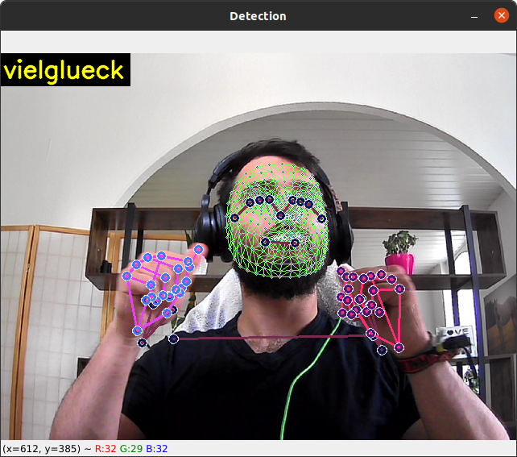

<!-- credits: https://worldvectorlogo.com/profile/spiderman2005 -->


# German Sign Language Detector

This is the supplementary proof of concept to show that the thesis which was claimed in the bachelorthesis is correct.

## Installation

If you want to run this program on your own machine use the package manager [pip](https://pip.pypa.io/en/stable/) to install the dependencies:

```bash
git clone https://github.com/Birkenpapier/GSL-Detector.git
cd GSL-Detector
pip3 install -r requirements.txt
```

## Usage

There are different ways to utilize the work in this repository

### Translate German Sign Language

To use this program you can use the pretrained weights action.h5 in this repository.

```bash
python3 3_Real_Time.py
```

### Training

Either you'll use the precaptured trainings data in **`MP_Data`** to evaluate the results:

```bash
python3 2_Train_Model.py
```

or you can capture new data for the hardcoded sign language actions **`['hallo', 'danke', 'vielglück', 'bitte', 'wo']`**:

```bash
python3 1_Get_Data.py
```

### Docker

If decide to take the easiest way to setup the project feel free to use the provided dockerfile and startup shell script in the repository:

```bash
sudo docker build -t gsl-detector . && sh runDocker.sh
```

After the successful start you can use the detector to detect one of the predefined actions:
<div align='center'>

</div>

## Contributing

Pull requests are welcome. For major changes, please open an issue first to discuss what you would like to change.


## License
[unlicense](https://unlicense.org)

## Citation
```
  @misc{birkenpapier2022gsldetector,
    author = {Kevin Peivareh},
    title = {German Sign Language Detector},
    year = {2022},
    howpublished = {\url{https://github.com/Birkenpapier/GSL-Detector}},
    note = {commit xxxxxxx}
  }
```

### Attribution/Thanks
- This project could not have happened without the tutorial and explanations given by [Nicholas Renotte](https://github.com/nicknochnack/ActionDetectionforSignLanguage). 
